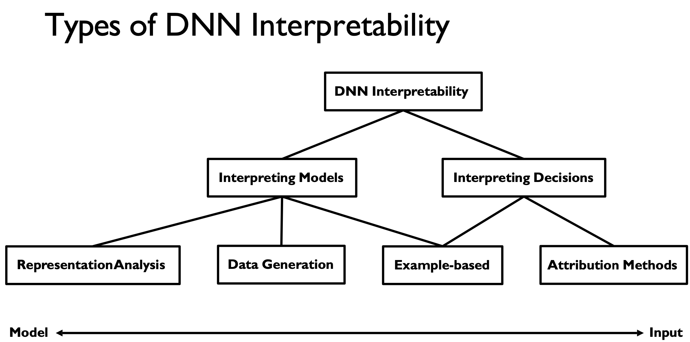
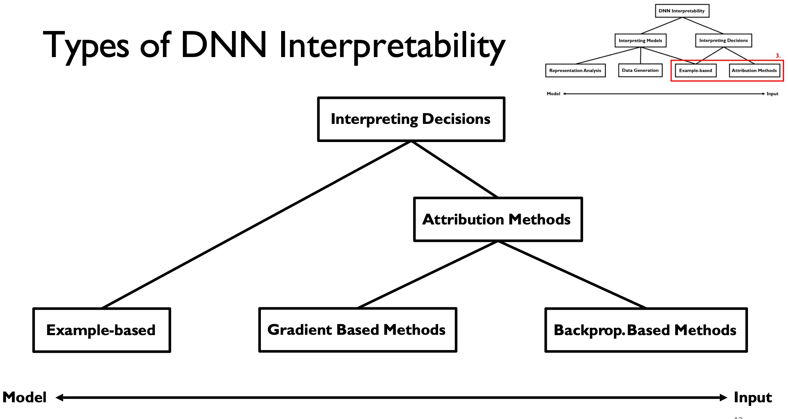

# Awesome Exlainability

Collection of **Explainability/Interpretability of Deep Neural Networks** from classics to recent models, mainly on deep neural networks. Please leavn me an issue if you catch something awful. I will add this slowly.

## Taxonomy
Full taxonomy by Manolis Kellis and lots of models fall into mainly two categories: interpreting *the model* or *its decision*. This repository will **mainly focus on the model decision**, in terms of interpreting the model

## Papers

+ Relevance Propagation
    + Bach, Sebastian, et al. "**On pixel-wise explanations for non-linear classifier decisions by layer-wise relevance propagation.**" PloS one 10.7 (2015): e0130140. [Paper](https://journals.plos.org/plosone/article?id=10.1371/journal.pone.0130140)
    + Montavon, Grégoire, et al. "**Explaining nonlinear classification decisions with deep taylor decomposition.**" Pattern recognition 65 (2017): 211-222. [Paper](https://www.sciencedirect.com/science/article/pii/S0031320316303582) [Nice PDF](https://idea-stat.snu.ac.kr/seminar/20161203/DTD.pdf)
    + Montavon, Grégoire, Wojciech Samek, and Klaus-Robert Müller. "**Methods for interpreting and understanding deep neural networks.**" Digital Signal Processing 73 (2018): 1-15. [Paper](https://www.sciencedirect.com/science/article/pii/S1051200417302385?via%3Dihub)
    + Ancona, Marco, et al. "Towards better understanding of gradient-based attribution methods for deep neural networks." arXiv preprint arXiv:1711.06104 (2017). [Paper](https://openreview.net/pdf?id=Sy21R9JAW)
    + Kohlbrenner, Maximilian, et al. "Towards best practice in explaining neural network decisions with LRP." 2020 International Joint Conference on Neural Networks (IJCNN). IEEE, 2020. [Paper](https://arxiv.org/pdf/1910.09840.pdf)

+ Transformer / ViT Explanation
    + Chefer, Hila, Shir Gur, and Lior Wolf. "**Transformer interpretability beyond attention visualization.**" Proceedings of the IEEE/CVF Conference on Computer Vision and Pattern Recognition. 2021. [Paper](https://openaccess.thecvf.com/content/CVPR2021/papers/Chefer_Transformer_Interpretability_Beyond_Attention_Visualization_CVPR_2021_paper.pdf)

## Videos/Tutorials/Lectures
+ Lec 05: **Interpretability, Dimensionality Reduction** by Prof. Manolis Kellis (from Spring 2021 6.874 MIT Computational Systems Biology: Deep Learning in the Life Sciences) [Video](https://www.youtube.com/watch?v=5fIy19GXAxI) [Lecture Note](https://mit6874.github.io/assets/sp2021/slides/l05.pdf)

+ CVPR 2018 Tutorial: **Interpreting and Explaining Deep Models in Computer Vision** by BOlei Zhou (MIT) [Part. 1](https://www.youtube.com/watch?v=LtbM2phNI7I), [Part. 2](https://www.youtube.com/watch?v=1aSS5GEH58U) [Documents](https://interpretablevision.github.io/index_cvpr2018.html)

+ GCPR 2017 Tutorial: **Interpretable Machine Learning** by Wojciech Samek & Klaus-Robert Muller [PDF](http://www.heatmapping.org/slides/2017_GCPR.pdf)

+ ICASSP 2017 Tutorial: **Methods for Interpreting and Understanding Deep Neural Networks** Wojciech Samek, Gregoire Montavon and Klaus-Robert Muller (No pdf/video found) [ICASSP2017 Tutorials](http://www.ieee-icassp2017.org/tutorials.html)